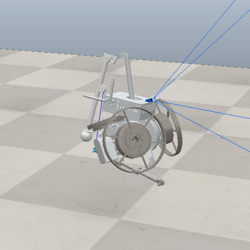

# Reinforcement Learning for Jumping

__Maryia Zhyrko s4093771 and Po-Kai Chen s4283341__

This project focuses on training a one-legged "Rex" hopper robot to jump
 using Reinforcement Learning (RL) with Stable Baselines3 and the
CoppeliaSim robotics simulator. The aim is to develop an agent capable
of stable and effective jumping maneuvers.

## Project Overview

The core of this project involves a custom Gymnasium environment that
interfaces with a CoppeliaSim simulation of the Rex hopper.
Reinforcement learning agents, primarily using Proximal Policy
Optimization (PPO) from Stable Baselines3, are trained to control the
robot's actuators. The project includes functionalities for different
training modes (e.g., `joints_only`), hyperparameter optimization, and
detailed asset management for the robot model.

## Original Model Acknowledgement

The robot model, assets, and initial concept adapted for this project are based on the RExHopper developed by the Robotics Exploration Lab.
* **RExHopper Repository**: [https://github.com/RoboticExplorationLab/RExHopper](https://github.com/RoboticExplorationLab/RExHopper)

## Demo Results

<div align="center">
  <table>
    <tr>
      <td align="center">
        
        <br>
        <b>Raw Input</b>
      </td>
      <td align="center">
        
        <br>
        <b>Actuator</b>
      </td>
      <td align="center">
        
        <br>
        <b>Refined Reward</b>
      </td>
    </tr>
  </table>
</div>

## Folder Structure

* **`/` (Root Directory)**
  * `README.md`: This file.
  * `env_runner.py`: Main script for configuring environments, training
    RL agents, and loading models.
  * `train.py`: Potentially an alternative script for running specific
    environment sessions or tests.
  * `hpo.py`: Script for Hyperparameter Optimization of the RL models.
  * `demo.py`: Script for loading and testing specific trained model checkpoints.
  * `requirements.txt`: Lists the Python dependencies for the project.
* **`/assets`**: Contains 3D model assets for the robot.
  * `hopper_rev08/meshes/*.STL`: Mesh files for the robot parts.
  * `hopper_rev08/urdf/*.urdf, *.csv`: URDF (Unified Robot Description
    Format) files and associated CSVs for the robot model.
* **`/env`**: Core Python package defining the reinforcement learning
  environment.
  * `mountain_env.py`: The custom Gymnasium environment
    (`CoppeliaMountainEnv`) defining observation/action spaces, step logic,
    and the crucial reward function.
  * `simulation_copp.py`: Handles the ZMQ communication interface with
    CoppeliaSim, robot control commands, physics stepping, and sensor data
    retrieval.
  * `actuator.py` & `actuator_param.py`: Define the actuator models
    and their specific parameters.
  * `robot_model.py`: Contains parameters and configurations for the
    robot model itself.
  * `scene_elements.py`: Utility for procedurally generating dynamic
    elements (like 'mountains') within the CoppeliaSim scene.
  * `utils.py`: Utility functions specifically for the environment and
    simulation.
* **`/scenes`**: Contains CoppeliaSim scene files (`.ttt`).
  * `rex_camera.ttt`: Scene configured with a camera sensor.
  * `rex_lidar.ttt`: Scene configured with a LiDAR sensor.
* **`/test`**: Contains scripts for testing and debugging.
  * `debug_sim.py`: For testing and debugging the CoppeliaSim connection
    and basic simulation interaction.
  * `joint_test.py`: For testing individual or groups of robot joints.
* **`/utils`**: Root-level utility scripts.
  * `coppelia_launcher.py`: Script to help automate the launching and
    closing of CoppeliaSim instances.
* **`/checkpoints`**: Root-level utility scripts.
  * Trained checkpoints.

## Prerequisites

* **Python** (e.g., 3.9 as indicated by `.pyc` files, but likely 3.8+ is
  fine).
* **CoppeliaSim Education Version** (e.g., V4.5.x or V4.6.x). The ZMQ
  Remote API server must be enabled (e.g., `simRemoteApi.start(19997)` in a
  scene script).
* **Python Libraries**: Listed in `requirements.txt`. Key dependencies
  include:
  * `gymnasium`
  * `stable-baselines3[extra]`
  * `numpy`
  * `opencv-python`
  * `coppeliasim-zmqremoteapi-client`

## Setup

1. **Clone the repository.**
2. **Install Python dependencies:**
   ```bash
   pip install -r requirements.txt
    ```

### 3. Hyperparameter Optimization

* Run the `hpo.py` script to perform hyperparameter searches (details of
  its usage would be within that script or require further
  documentation).

### 4. Modifying Environment & Rewards

* The core logic for agent-environment interaction, including the
  **reward shaping**, is in `env/mountain_env.py` (`CoppeliaMountainEnv`
  class).
* Low-level simulation control and action processing (like reaction
  wheel scaling) is in `env/simulation_copp.py`.
* Actuator characteristics are in `env/actuator.py` and
  `env/actuator_param.py`.

### 5. Testing

* Use scripts in the `/test` directory (e.g., `debug_sim.py`,
  `joint_test.py`) for specific tests.
* The `env_runner.py` also has a section for testing the trained agent
  after the learning phase. Set `render_mode="human"` for visualization.

## Key Files

* `env_runner.py`: Main training and execution script.
* `env/mountain_env.py`: Gym environment definition (CRITICAL for RL
  behavior).
* `env/simulation_copp.py`: CoppeliaSim communication and control logic.
* `scenes/rex_camera.ttt`: Primary CoppeliaSim scene for camera-based or
  `joints_only` modes.
* `requirements.txt`: Python dependencies.
* `hpo.py`: For hyperparameter optimization.

## Notes

* The project has seen significant iteration on reward functions to
  achieve stable jumping.
* The `joints_only` mode, combined with specific reaction wheel action
  scaling in `simulation_copp.py`, has shown the most promise for stable
  learning.
* Always ensure CoppeliaSim is running and correctly configured before
  launching Python training scripts.

## Running Demos

To visualize the performance of different trained models, use the `demo.py` script with the appropriate checkpoint and arguments.

* **Raw Input Model:** This demo runs the model trained with raw sensor inputs.
    ```bash
    python demo.py --checkpoint_path checkpoints/raw_input.zip --raw
    ```
* **Actuator Control Model:** This demo runs the model focused on actuator control.
    ```bash
    python demo.py --checkpoint_path checkpoints/actuator.zip
    ```
* **Refined Reward Model:** This demo runs the model trained with the newer, refined reward function in normal mode.
    ```bash
    python demo.py --checkpoint_path checkpoints/new_reward.zip --mode normal
    ```